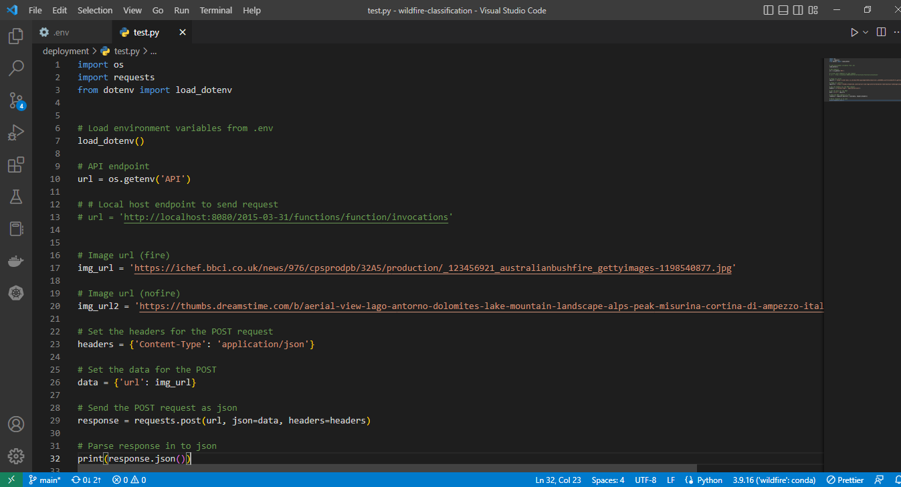

# Wildfire Image Classification with TensorFlow Lite

This project is aimed at developing a machine learning model to classify images of wildfires and non-wildfires with high accuracy. The primary motivation behind this project is to assist in the early detection and monitoring of wildfires, which can help prevent the loss of life and property. The dataset used in this project can be found on [Kaggle](https://www.kaggle.com/datasets/brsdincer/wildfire-detection-image-data).

## Project file structure

The project's file organization is structured as follows:

```
.
|-- LICENSE
|-- README.md
|-- assets
|   |-- fire_img.jpg
|   |-- land_img.jpg
|   |-- ...
|-- dataset
|   `-- forest_fire
|       |-- testing
|       |   |-- fire
|       |   |   |-- abc169.jpg
|       |   |   |-- abc170.jpg
|       |   |   |-- abc171.jpg
|       |   |   |-- ...
|       |   `-- nofire
|       |       |-- abc335.jpg
|       |       |-- abc336.jpg
|       |       |-- abc337.jpg
|       |       |-- ...
|       `-- training_and_validation
|           |-- fire
|           |   |-- abc001.jpg
|           |   |-- abc002.jpg
|           |   |-- abc003.jpg
|           |   |-- ...
|           `-- nofire
|               |-- abc191.jpg
|               |-- abc192.jpg
|               |-- abc193.jpg
|               |-- ...
|-- deployment
|   |-- Dockerfile
|   |-- app.py
|   |-- bg-img.jpg
|   |-- lambda_function.py
|   |-- test.py
|   `-- wildfire-model.tflite
|-- models
|   |-- wildfire-model.tflite
|   `-- xception_v5_01_0.985.h5e
|-- notebooks
|   |-- 01-image-analysis.ipynb
|   |-- 02-experimenting-pretrained-models.ipynb
|   |-- 03-model-training.ipynb
|   |-- 04-model-evaluation.ipynb
|   `-- 05-tflite-model.ipynb
`-- requirements.txt
```

The following is a description of the project's file structure:

- `LICENSE`: This file contains the legal terms and conditions under which the project can be used, distributed, and modified. It outlines the copyright information and any limitations on the use of the project's code and assets.
- `README.md`: This file provides an overview of the project, including the purpose, dataset, model, deployment, and usage instructions. It also includes the project's file structure and requirements.
- `assets`: This folder contains any additional resources or materials that are used in the project, such as images, videos, or audio files.
- `dataset`: This folder contains the data used for training and testing the model, such as image files of "fire" and "nofire" class.
- `deployment`: This folder contains the files and instructions needed to deploy the model, such as the TFLite model, the lambda function, and the Dockerfile, Streamlit web app.
- `models`: This folder contains the trained model, along with any intermediate models created during the development process.
- `notebooks`: This folder contains Jupyter Notebooks that oure used to analyze, train and test the model.
- `requirements.txt`: This file lists all the dependencies required to run the project, including specific versions. This is used to ensure that the project can be set up and run on other machines with the same dependencies.

## Requirements

The following tools oure utilized in the development of this project:

- Python 3
- TensorFlow
- Keras
- numpy
- pandas
- Docker
- AWS CLI
- Amazon Elastic Container Registry (ECR)
- Amazon Lambda
- Amazon API Gateway
- Streamlit
- Huggingface spaces

## Dataset

The dataset contains a total of 1900 images, which are divided into 1832 images for training and 68 images for testing. The training set comprises of 928 images of "fire" class and 904 images of "non-fire" class, while the testing set consists of 22 images of "fire" class and 46 images of "non-fire" class.

## Model

The data is analyzed and experimented on different pretrained models from TensorFlow, then Xception model is used for further experiments for model improvement. The final model is then converted into TFLite model for deployment.

## Deployment

For deployment, the model and `lambda_function.py` is dockerized then the docker image is uploaded on AWS ECR. Then Lambda function and API Gateway is created on AWS.

## Web App

The web application is developed using Streamlit, which can be found in the script `app.py`. The application is deployed on Huggingface spaces.

## Results

The model achieved an accuracy of 98% on the test set, indicating that it is able to accurately distinguish between wildfire and non-wildfire images. The web app allows users to easily classify new images and view the results.

## Setting up the project

To experiment and train our own model, follow these steps:

- Create and activate a virtual environment on our machine (Conda and Python 3.9 are recommended: `conda create -n <myenv> python=3.9`)
- Install the necessary packages by running `pip install -r requirements.txt` and install the TFLite runtime using `pip install --extra-index-url https://google-coral.github.io/py-repo/ tflite_runtime`

## Testing the project

To run the project and test the model's predictions:

- Change the current directory to `deployment` by running `cd deployment`
- To test the model locally, use the following commands in the terminal:
  - Start the command line interpreter by running `ipython`
  - Import the lambda function as a module by running `import lambda_function`
  - Make predictions by calling the `predict` method, for example `lambda_function.predict('https://ichef.bbci.co.uk/news/976/cpsprodpb/32A5/production/_123456921_australianbushfire_gettyimages-1198540877.jpg')`
  - Since the image belongs to the "fire" class, the output should look something like this: `{'fire': 1.0, 'nofire': 0.0}`

## Testing the web application locally

To test the model's predictions locally, we can use the web application that was built using [Streamlit](https://streamlit.io/). Before running the application, make sure that we are in the `deployment` directory. To launch the web application and start the Streamlit server, run the command `streamlit run app.py`. This command will start the server and open the web application in the browser, allowing we to test the model's predictions.


## Running the application with a Docker image

We can easily run the application by using a pre-built Docker image, which can be downloaded from [Docker Hub](https://hub.docker.com/): [wildfire-classification](https://hub.docker.com/repository/docker/awon08/tflite-wildfire-model/general)

To download the image, we can use the following command:

```
docker pull awon08/tflite-wildfire-model
```

Once the image is downloaded, we can start the container with the port 8080:

```
docker run -it --rm -p 8080:8080 awon08/tflite-wildfire-model
```

On another terminal, ensure that the virtual environment is activated and then run the command `python test.py` to test the running container:


## Creating a customized Docker image

If we need to create a customized version of the Docker image, we can use the `Dockerfile` located in the `deployment` directory. To build the image, we can use the following command:

```
docker build -t <image_name> .
```

Where `<image_name>` is the name we want to give to our image. This command will build an image based on the instructions in the `Dockerfile`.

Once the image is built, we can run the container using the following command:

```
docker run -it --rm -p 8080:8080 <image_name>
```

This command will start the container and map the host's port 8080 to the container's port 8080.

On a separate terminal, activate our environment and run `python test.py` to see the model's prediction on an image.

It's worth noting that the `.` at the end of the command tells Docker to look for the `Dockerfile` in the current directory. If the `Dockerfile` is located in another directory, we should specify the path to that directory instead.

## Deployment to the cloud

To deploy the Docker container as a Lambda function, we need to follow these steps:

- Create an ECR repository on AWS and push the Docker image to it.
- Create an IAM role for the Lambda function.
- Create a Lambda function and associate it with the IAM role.
- Create an API Gateway to trigger the Lambda function.
- Deploy the Lambda function and the API Gateway.

Once these steps are completed, the Lambda function will be able to respond to incoming HTTP requests, it will use the incoming image url and run the container to make predictions based on the image. The function will then return the prediction result to the client.

### Pushing a Docker Image to an ECR Repository

Here are the instructions to push a Docker image to an ECR repository:

1. First, we need to have the AWS CLI installed and configured on our machine. we can install the AWS CLI by following the instructions [here](https://docs.aws.amazon.com/cli/latest/userguide/cli-chap-install.html)
2. Next, we need to create an ECR repository. we can do this by logging into the AWS Management Console and navigating to the ECR service. From there, we can create a new repository with the name "tflite-wildfire-model".
3. Once the repository is created, we will be given a unique URL for the repository. we will need this URL to push the image to the repository.
4. Next, we will need to authenticate the Docker daemon to our registry. we can do this by running the following command:
   ```
   aws ecr get-login-password --region <our_region> | docker login --username AWS --password-stdin <our_account_id>.dkr.ecr.<our_region>.amazonaws.com
   ```
5. Next, we need to tag the image using the unique URL of our ECR repository. The format for the image name should be "account_id.dkr.ecr.region.amazonaws.com/image_name:version"
   ```
   docker tag tflite-wildfire-model:latest <our_account_id>.dkr.ecr.<our_region>.amazonaws.com/tflite-wildfire-model:latest
   ```
6. Finally, we can push the image to the ECR.

### Creating an IAM Role for the Lambda Function

An IAM role is a set of permissions that define what actions the Lambda function is allowed to perform on AWS resources. The following are the steps to create an IAM role for the Lambda function:

1. Log into the AWS Management Console and navigate to the IAM service.
2. Click on the "Roles" menu item and then click the "Create role" button.
3. Select "Lambda" as the service that will use the role.
4. Attach the necessary permissions policies to the role. For example, we may need to attach the "AWSLambdaExecute" policy to allow the function to run.
5. Give the role a name and create the role.

Once the IAM role is created, we will need to assign it to the Lambda function when we create the function in the next step.

### Creating a Lambda Function and Selecting a Container Image to Deploy

When creating a Lambda function, we can select a container image to deploy for our function. Here are the steps to do so:

1. Navigate to the Lambda service on the AWS Management Console.
2. Click on the "Functions" menu item and then click the "Create function" button.
3. Select "Container image"
4. Give the function a name.
5. In the "Container image URI" section, we need to specify the container image uri which is available in the ECR repository. (e.g `<our_account_id>.dkr.ecr.<our_region>.amazonaws.com/tflite-wildfire-model:latest`)
6. Click on "Create function" to create the function.
7. Next Select Configuration > Increase Memory to 1024 and Timeout to 30 sec > Click Save
8. Select Test to test the function > Add image url in the body (JSON) (e.g, `{"url": "https://ichef.bbci.co.uk/news/976/cpsprodpb/32A5/production/_123456921_australianbushfire_gettyimages-1198540877.jpg"}`) > Click Test

Once the Lambda function is created, it will be able to run the container image and make predictions based on the incoming data received from the API Gateway endpoint.

### Creating an API Gateway to Trigger the Lambda Function

An API Gateway is a service that allows we to create, deploy, and manage a RESTful API to trigger the Lambda function. Here are the steps to create an API Gateway:

1. Navigate to the API Gateway service on the AWS Management Console.
2. Click on the "Create API" button and select "REST API".
3. Give the API a name and click "Create API".
4. Create a new resource and give it a name, like "predict".
5. Create a new POST method for the resource and select the Lambda function we created earlier as the integration point.
6. Deploy the API to a stage, such as "prod" or "test".
7. Make sure to take note of the API URL, including the resource name as the endpoint (e.g., `https://7gsheeigkg.execute-api.ap-south-1.amazonaws.com/test/predict`) 

> **Note**: It is important to keep in mind that the API URL should not be pushed to GitHub without securing it first. Since we have already installed the package [python-dotenv](https://pypi.org/project/python-dotenv/) from `requirements.txt` all we need is to create a file named `.env` in the project's root directory, and then loading the API URL as an environment variable in the `test.py` script. Below are examples of how this should be done:




To test the functionality of the created API Gateway, navigate to the `deployment` directory and run the command `python test.py`. This will send a POST request to the specified endpoint with an image URL as input, trigger the Lambda function, make predictions using the incoming data, and return the result of the predictions.

## Deploying Streamlit app on Huggingface spaces

To deploy a Streamlit app on Huggingface spaces, follow these steps:

1. Create an account on [Huggingface.co](https://www.huggingface.co/).
2. Go to [Hugging Face Spaces](https://huggingface.co/spaces) and create a new space.
3. In the newly created space, give it a deployment name, choose a license, select "Streamlit" as the framework and create the space.
4. In the "Files and versions" tab, click on "Add file" then "Upload files" to upload the `app.py` (Streamlit web app) and `bg-img.jpg` (background image) located in the `deployment` directory and commit the files.
5. Click on "Add file" again and click on "Create a new file" and name it `requirements.txt` and include the `python-dotenv` package to install and then make commit.
   
6. In the "Settings" tab, add repository secrets (API URL)
   
   

With these steps completed, the app should be running if everything is set up correctly.


Access the Wildfire Image Classification App at this [link](https://huggingface.co/spaces/awon08/wildfire-image-classification)

## Conclusion

This project demonstrates the capabilities of using machine learning to classify wildfire images and deploying the model on cloud services. It has potential for various applications such as wildfire detection and monitoring in different industries.